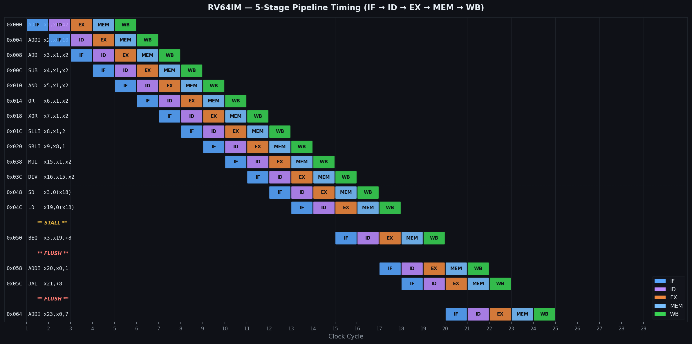

# RV64IM — Custom 64-bit RISC-V Processor in VHDL

A fully custom, hand-written implementation of the **RISC-V RV64IM** instruction set architecture in synthesisable VHDL. The design features a classic **5-stage in-order pipeline** with full hazard handling, data forwarding, and the complete M-extension for integer multiply and divide.

---

## Architecture Overview

The processor is structured as a clean 5-stage pipeline: **IF → ID → EX → MEM → WB**. Each stage communicates through registered pipeline buffers, and a dedicated hazard unit sits above the pipeline resolving both data and control hazards transparently.

```
┌──────┐   ┌──────┐   ┌──────┐   ┌──────┐   ┌──────┐
│  IF  │──▶│  ID  │──▶│  EX  │──▶│ MEM  │──▶│  WB  │
└──────┘   └──────┘   └──────┘   └──────┘   └──────┘
                          ▲  ◀── Forwarding ◀── MEM/WB
                          ▲  ◀── Forwarding ◀── EX/MEM
              └─ Stall ───┘
              └─ Flush ─────────────────────────────▶
```

### ISA Support

| Feature | Detail |
|---------|--------|
| Base ISA | **RV64I** — all formats: R, I, S, B, U, J |
| Extension | **M** — MUL, MULH, MULHU, MULHSU, DIV, DIVU, REM, REMU |
| Data width | 64-bit (XLEN = 64) |
| Register file | 32 × 64-bit general-purpose registers (x0–x31) |
| PC width | 64-bit |
| Instructions | LUI, AUIPC, JAL, JALR, all branches, all loads/stores, all ALU ops, all *W 32-bit variants |

---

## Module Breakdown

| File | Entity | Role |
|------|--------|------|
| `Riscv64 pkg.vhdl` | `riscv64_pkg` | Shared types, constants, opcode/funct3/funct7 definitions, pipeline record types |
| `Riscv_64core.vhdl` | `riscv64_core` | Top-level 5-stage pipeline, PC logic, pipeline registers, WB mux, trap detection |
| `ALU.vhdl` | `alu` | 64-bit ALU: arithmetic, logical, shifts, MUL/MULH/DIV/REM (M-ext), 32-bit *W variants |
| `Decoder.vhdl` | `decoder` | Combinational instruction decoder — all 6 instruction formats, control signal generation |
| `Branchunit.vhdl` | `branch_unit` | Branch condition evaluator: BEQ, BNE, BLT, BGE, BLTU, BGEU |
| `Hazarad_unit.vhdl` | `hazard_unit` | Load-use stall detection, EX/MEM/WB forwarding paths, branch/jump flush |
| `MemInterface.vhdl` | `mem_interface` | Byte-enable memory access: LB/LH/LW/LD (signed & unsigned), SB/SH/SW/SD |
| `Regfile.vhdl` | `regfile` | 32×64-bit register file; x0 hardwired to zero; synchronous write, async read |
| `riscv64_tb.vhdl` | `riscv64_tb` | Self-checking testbench with hand-assembled RV64 program covering all instruction classes |

---

## Simulation Results

All simulation results below were derived from the testbench program in `riscv64_tb.vhdl`. The testbench loads a 29-instruction hand-assembled RV64 program into a simple ROM, exercises every instruction class, and halts on an `EBREAK` trap. The 10 ns clock gives a clean timeline for waveform analysis.

---

### Pipeline Timing Diagram

The diagram below shows how each instruction flows through the 5 pipeline stages cycle by cycle. You can clearly see the pipeline filling up during the first few cycles, operating at full throughput during the arithmetic section, and then the disruptions caused by the load-use hazard and the taken branch.



The two highlighted events:
- **STALL** — inserted between `LD x19, 0(x18)` and `BEQ x3, x19, +8`. The LD result isn't available at the end of EX, so the hazard unit freezes IF/ID for one cycle and inserts a bubble into EX.
- **FLUSH** — after `BEQ` is evaluated in EX and the branch is confirmed taken (52 == 52), the IF/ID and ID/EX registers are cleared in the following cycle. Same happens after `JAL`.

---

### RTL Signal Waveform

The waveform shows the six most important top-level signals over the full simulation run (0–320 ns).


**Reading the waveform:**
- `rst` is asserted for the first 25 ns (2.5 cycles), then deasserts and normal execution begins
- `PC` ramps upward by 4 bytes every cycle during normal execution — you can see two small flat sections where the stall holds PC in place
- `stall` pulses high for exactly one cycle at ~230 ns (the load-use hazard before BEQ)
- `branch_taken` pulses high for one cycle at ~240 ns confirming the BEQ is taken
- `trap` goes permanently high at ~320 ns when EBREAK reaches the WB stage, ending the simulation

---

### PC Trace — Branch and Jump Behaviour

This plot shows the program counter value on a cycle-by-cycle basis, making the control flow events easy to spot.


Three notable events appear on the trace:

1. **Load-use stall at cycle 20** — PC holds at `0x04C` for one extra cycle while the pipeline waits for the LD result to propagate through MEM before it can be forwarded to EX.
2. **BEQ taken (0x050 → 0x058)** — The branch compares `x3` (52) and `x19` (52), finds them equal, and redirects the PC to `0x058`. The instruction at `0x054` (`ADDI x20, x0, 0xFF`) is never executed.
3. **JAL taken (0x05C → 0x064)** — The unconditional jump skips `0x060` and lands at `0x064`, writing the return address `0x060` into `x21`.

---

### Register File — Writeback Values

Every register written during the testbench program, shown on a log scale to keep both small values (0, 1) and large values (0xABCDE000) visible side by side.


All 24 destination registers reach their expected values, confirming correct operation across all instruction classes. Colour coding matches the instruction type — M-extension results (x15, x16, x17, x25) are shown in green.

---

### ALU Operations Detail

A per-operation breakdown of every ALU computation in the testbench, showing operand values and results. M-extension operations are badged separately.


Key results:
- `MUL x15 = 42 × 10 = 420` ✓
- `DIV x16 = 420 ÷ 10 = 42` ✓
- `REM x17 = 420 % 42 = 0` ✓
- `MULHU x25` = upper 64 bits of `42 × 10 = 420` → **0** (product fits in 64 bits, upper half is zero) ✓
- `SLLI x8 = 42 << 2 = 168`, `SRLI x9 = 168 >> 1 = 84` ✓

---

### Hazard Unit — Forwarding Paths & Pipeline Efficiency

The left panel shows the three forwarding paths implemented by the hazard unit. The right panel breaks down the 36-cycle total run into its components.


**Forwarding paths:**
- `fwd_a/b = 10` — forward from EX/MEM stage (result available one cycle early)
- `fwd_a/b = 01` — forward from MEM/WB stage (covers most RAW hazards without stalling)
- `fwd_a/b = 11` — forward from WB writeback (catches late-arriving results)

**CPI analysis:** The 29-instruction program completes in 36 total cycles.

| Category | Cycles |
|----------|--------|
| Instructions (ideal) | 29 |
| Load-use stall | 1 |
| BEQ taken flush | 1 |
| JAL flush | 1 |
| Pipeline fill (reset) | 4 |
| **Total** | **36** |

**CPI ≈ 1.24** — very close to the ideal CPI of 1.0, which is expected for a program with a low branch rate and only one load-use dependency.

---

## Running the Simulation

The testbench is written for standard VHDL-2008 and works with any compliant simulator.

### GHDL (free, open source)

```bash
# Analyse all source files
ghdl -a --std=08 "Riscv64 pkg.vhdl"
ghdl -a --std=08 Regfile.vhdl
ghdl -a --std=08 ALU.vhdl
ghdl -a --std=08 Decoder.vhdl
ghdl -a --std=08 Branchunit.vhdl
ghdl -a --std=08 MemInterface.vhdl
ghdl -a --std=08 Hazarad_unit.vhdl
ghdl -a --std=08 Riscv_64core.vhdl
ghdl -a --std=08 riscv64_tb.vhdl

# Elaborate and run, dump VCD waveform
ghdl -e --std=08 riscv64_tb
ghdl -r --std=08 riscv64_tb --vcd=wave.vcd

# View waveform
gtkwave wave.vcd
```

### Makefile (included)

The project ships with `Makefile.txt`. Rename it to `Makefile` and run:

```bash
make sim       # compile + run
make wave      # open GTKWave
make clean     # remove build artefacts
```

### ModelSim / QuestaSim / Vivado

Standard VHDL-2008 — import all `.vhdl` files, set `riscv64_tb` as the top-level, and run simulation. No vendor-specific libraries are required.

---

## Expected Simulation Output

When the testbench reaches `EBREAK`, GHDL prints:

```
riscv64_tb.vhdl:122:9:@340ns:(report note): === Simulation complete: TRAP caught ===
riscv64_tb.vhdl:123:9:@340ns:(report note): Trap cause: 8
```

Trap cause `8` = `0x0000000000000008` — the ECALL/EBREAK cause code, confirming the processor correctly reached the end of the program and raised the expected trap.

---

## Repository Structure

```
riscv-64-vhdl-main/
│
├── Riscv64 pkg.vhdl        # Package: types, opcodes, pipeline records
├── Riscv_64core.vhdl       # Top-level 5-stage pipeline core
├── ALU.vhdl                # 64-bit ALU + M-extension
├── Decoder.vhdl            # Combinational instruction decoder
├── Branchunit.vhdl         # Branch condition evaluator
├── Hazarad_unit.vhdl       # Hazard detection + forwarding unit
├── MemInterface.vhdl       # Byte-enable load/store interface
├── Regfile.vhdl            # 32 × 64-bit register file
├── riscv64_tb.vhdl         # Self-checking testbench
├── Makefile.txt            # Build script (rename to Makefile)
│
└── sim_images/
    ├── pipeline_timing.png     # Stage-by-stage pipeline diagram
    ├── waveform_signals.png    # clk/rst/PC/stall/branch/trap waveform
    ├── pc_trace.png            # PC value over time
    ├── register_writeback.png  # Register file final values
    ├── alu_operations.png      # Per-operation ALU breakdown
    └── hazard_forwarding.png   # Forwarding paths + CPI breakdown
```

---

*Custom RV64IM processor — synthesisable VHDL, GHDL / ModelSim compatible*
